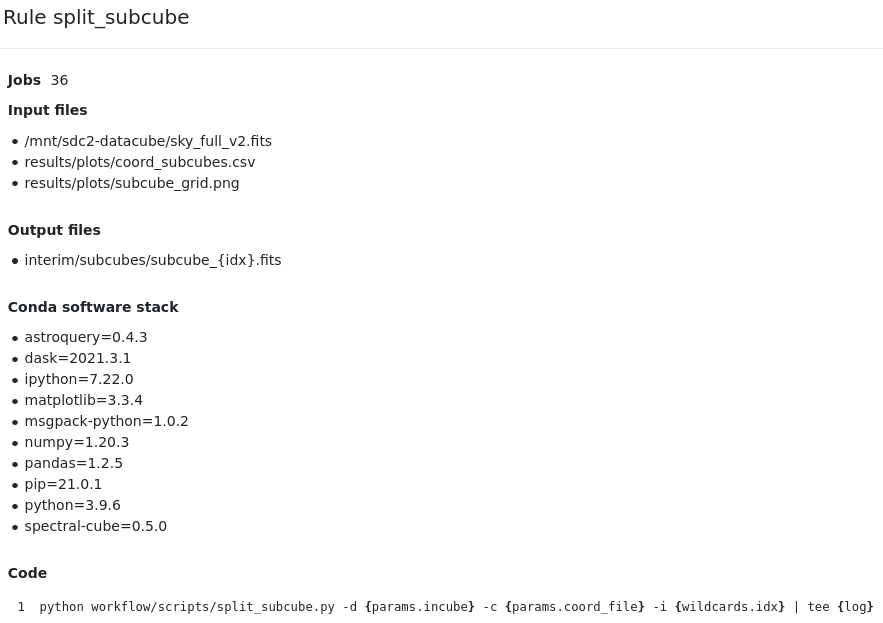

# HI-FRIENDS team: participation in the SKA Data Challenge 2

This repository contains the workflow used to find and characterize the HI sources in the data cube of the [SKA Data Challenge 2](https://sdc2.astronomers.skatelescope.org/). This is developed by the HI-FRIENDS team. The execution of the workflow was conducted in the [SP-SRC](https://spsrc-user-docs.readthedocs.io/en/latest/) cluster at the [IAA-CSIC](https://www.iaa.csic.es/en/).


[](https://opensource.org/licenses/)

## Summary

The workflow is managed and executed using [snakemake](https://snakemake.readthedocs.io/en/stable/) workflow management system. It uses `spectral-cube` based on `dask` parallelization tool and `astropy` suite to divide the large cube in smaller pieces. On each of the subcubes, we execute [Sofia-2](https://github.com/SoFiA-Admin/SoFiA-2) for masking the subcubes, find sources and characterize their properties. Finally, the individual catalogs are cleaned, concatenated into a single catalog, and duplicates from the overlapping regions are eliminated. Some diagnostic plots are produced using Jupyter notebook.

## Workflow structure and products

The following diagram shows the rules executed by the workflow and their dependencies. Each rule is associated with the execution of either a python script, a jupyter notebook or a bash script.


The actual execution of the workflow requires some of the rules to be executed multiple times. In particular each subcube is processed sequentially. The next diagram shows the [DAG](https://en.wikipedia.org/wiki/Directed_acyclic_graph) of an example execution. The number of parallel jobs is variable, here we show the case of 16 subcubes, although for the full SDC2 cube we may use 36 or 49 subcubes.


Each rule has associated input and output files. The following diagram shows the stage at which the relevant files are 


### Workflow file structure
The workflow consists of a master `Snakefile` file (analogous to a Makefile for `make`), a series of conda environments, scripts and notebooks to be executed, and rules to manage the workflow tasks. The file organization of the workflow is the following:
```
workflow/
├── Snakefile
├── envs
│   ├── analysis.yml
│   ├── chunk_data.yml
│   ├── process_data.yml
│   ├── snakemake.yml
│   └── xmatch_catalogs.yml
├── notebooks
│   └── sdc2_hi-friends.ipynb
├── rules
│   ├── chunk_data.smk
│   ├── concatenate_catalogs.smk
│   ├── run_sofia.smk
│   ├── summary.smk
│   └── visualize_products.smk
└── scripts
    ├── define_chunks.py
    ├── eliminate_duplicates.py
    ├── run_sofia.py
    ├── sofia2cat.py
    └── split_subcube.py
```

### Output products
All the outputs of the workflow are stored in `results`. This is the first level organization of the directories:

```
results/
├── catalogs
├── logs
├── notebooks
├── plots
└── sofia
```
In particular, each rule generates a log for the execution of the scripts. They are stored in `results/logs`. Each subdirectory contains individual logs for each executtion, as shown in this example:
```
logs/
├── concatenate
│   ├── concatenate_catalogs.log
│   └── eliminate_duplicates.log
├── define_chunks
│   └── define_chunks.log
├── run_sofia
│   ├── subcube_0.log
│   ├── subcube_1.log
│   ├── subcube_2.log
│   └── subcube_3.log
├── sofia2cat
│   ├── subcube_0.log
│   ├── subcube_1.log
│   ├── subcube_2.log
│   └── subcube_3.log
├── split_subcube
│   ├── subcube_0.log
│   ├── subcube_1.log
│   ├── subcube_2.log
│   └── subcube_3.log
├── summary
│   ├── dag.log
│   ├── filegraph.log
│   └── rulegraph.log
└── visualize
    └── visualize.log
```

The individual fits files of the subcubes are storesd in the directory `interim`, because they may be large to store. The workflow can be setup to make them temporary files, so they are removed as soon as they are not needed anymore
```
interim/
└── subcubes
    ├── subcube_0.fits
    ├── subcube_1.fits
    ├── subcube_2.fits
    └── subcube_3.fits
```

### Snakemake execution and diagrams

Additional files summarizing the execution of the workflow and the Snakemake rules are stored in 
```
summary/
├── dag.svg
├── filegraph.svg
├── report.html
└── rulegraph.svg
```
In particular, `report.hml` contains a description of the rules, including the provenance of each execution, as well as the statistics on execution times of each rule.

Interactive report showing the workflow structure:


When clicking in one of the nodes, full provenance is provided:


Statistics of the time required for each execution:


## Documentation

[Documentation](https://linktodocumentation)


## Requirements

The requirements of the workflow are self-contained, and they will be retrieved and installed during execution using `conda`. To run the pipeline you need to have [snakemake](https://snakemake.readthedocs.io/en/stable/) installed. This can be obtained from the `environment.yml` file in the repository as explained in the next Section. The workflow uses the following packages:

  - astropy=4.2.1
  - astroquery=0.4.1
  - astroquery=0.4.3
  - dask=2021.3.1
  - gitpython=3.1.18
  - ipython=7.22.0
  - ipython=7.25.0
  - jinja2=3.0.1
  - jupyter=1.0.0
  - jupyterlab=3.0.16
  - jupyterlab_pygments=0.1.2
  - matplotlib=3.3.4
  - matplotlib=3.4.2
  - msgpack-python=1.0.2
  - networkx=2.6.1
  - numpy=1.20.1
  - numpy=1.20.3
  - numpy=1.21.1
  - pandas=1.2.2
  - pandas=1.2.5
  - pandas=1.3.0
  - pip=21.0.1
  - pygments=2.9.0
  - pygraphviz=1.7
  - python-wget=3.2
  - python=3.8.6
  - python=3.9.6
  - pyyaml=5.4.1
  - scipy=1.7.0
  - seaborn=0.11.1
  - snakemake-minimal=6.6.1
  - sofia-2=2.3.0
  - spectral-cube=0.5.0
  - wget=1.20.1

It is not recommended to install them individually, because Snakemake will use conda internally to install the different environments included in this repository. This list is just for reference purposes.

## Installation

To deploy this project, first you need to install conda, get the pipeline, and install snakemake. 


1. Get conda

You don't need to run it if you already have a working `conda` installation. If you don't have `conda` follow the steps below to install it in the local directory `conda-install`.

```bash
 curl --output Miniconda.sh https://repo.anaconda.com/miniconda/Miniconda3-latest-Linux-x86_64.sh
 bash Miniconda.sh -b -p conda-install
 source conda-install/etc/profile.d/conda.sh
 conda install mamba --channel conda-forge --yes
```

2. Get the pipeline and install snakemake

```bash
git clone https://github.com/HI-FRIENDS-SDC2/hi-friends
cd hi-friends
mamba env create -f environment.yml
conda activate snakemake
```

# Workflow execution

Follow these commands to run the pipeline on a small dataset to verify everything works:
```bash
python run.py --check
```

First, this will create all the conda environments needed for the different stages of the pipeline. Then, they will be executed.

To execute the pipeline on your own dataset, first remove the directories `results` and `interim` if you have created them. You may want to edit `config/config.yml` to define your configuration, including the dataset to process. Run the pipeline with:
```bash
python run.py
```

## Related

Here are some related projects

- [Sofia-2](https://github.com/SoFiA-Admin/SoFiA-2)
- [SKA Data Challenge 2](https://sdc2.astronomers.skatelescope.org/)
- [SKA](https://sdc2.astronomers.skatelescope.org/)
