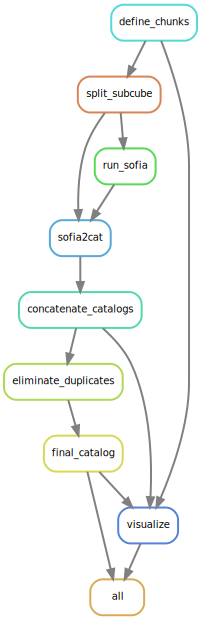
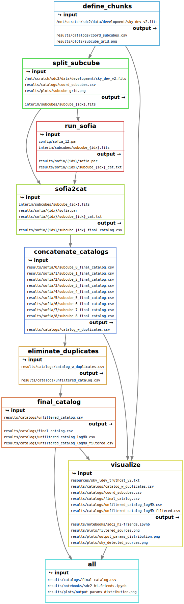

# HI-FRIENDS team: participation in the SKA Data Challenge 2

This repository contains the workflow used to find and characterize the HI sources in the data cube of the [SKA Data Challenge 2](https://sdc2.astronomers.skatelescope.org/). This is developed by the HI-FRIENDS team. The execution of the workflow was conducted in the [SP-SRC](https://spsrc-user-docs.readthedocs.io/en/latest/) cluster at the [IAA-CSIC](https://www.iaa.csic.es/en/).


[](https://opensource.org/licenses/)

## Summary

The workflow is managed and executed using [snakemake](https://snakemake.readthedocs.io/en/stable/) workflow management system. It uses `spectral-cube` based on `dask` parallelization tool and `astropy` suite to divide the large cube in smaller pieces. On each of the subcubes, we execute [Sofia-2](https://github.com/SoFiA-Admin/SoFiA-2) for masking the subcubes, find sources and characterize their properties. Finally, the individual catalogs are cleaned, concatenated into a single catalog, and duplicates from the overlapping regions are eliminated. Some diagnostic plots are produced using Jupyter notebook.

This is the dependencies between the rules of the workflow:


And this is the DAG of the execution. The number of parallel jobs required is variable, here we show the case of 4 subcubes, although for the full SDC2 cube we may use 36 or 49 subcubes.


The input and output files can be summarized here:

 
## Documentation

[Documentation](https://linktodocumentation)


## Requirements

The requirements of the workflow are self-contained, and will be retrieved and installed during execution using `conda`. To run the pipeline you need to have [snakemake](https://snakemake.readthedocs.io/en/stable/) installed. This can be obtained from the `environment.yml` file in the repository as explained in the next Section. The workflow uses the following packages:
  - aplpy
  - astropy
  - astroquery
  - dask
  - gitpython
  - ipython
  - jinja2
  - jupyter
  - jupyterlab
  - matplotlib
  - networkx
  - numpy
  - pandas
  - pip
  - pygments
  - pygraphviz
  - python
  - python-wget
  - pyyaml
  - scipy
  - seaborn
  - snakemake-minimal
  - sofia-2
  - spectral-cube
  - wget

## Installation

To deploy this project, first you need to install conda, get the pipeline, and install snakemake. 


1. Get conda

You don't need to run it if you already have a working `conda` installation. If you don't have `conda` follow the steps below to install it in the local directory `conda-install`.

```bash
 curl --output Miniconda.sh https://repo.anaconda.com/miniconda/Miniconda3-latest-Linux-x86_64.sh
 bash Miniconda.sh -b -p conda-install
 source conda-install/etc/profile.d/conda.sh
 conda install mamba --channel conda-forge --yes
```

2. Get the pipeline and install snakemake

```bash
git clone https://github.com/HI-FRIENDS-SDC2/hi-friends
cd hi-friends
mamba env create -f environment.yml
conda activate snakemake
```

# Workflow execution

Follow these commands to run the pipeline on a small dataset to verify everything works:
```bash
python run.py --check
```

First, this will create all the conda environments needed for the different stages of the pipeline. Then, they will be executed.

To execute the pipeline on your own dataset, first remove the directories `results` and `interim` if you have created them. You may want to edit `config/config.yml` to define your configuration, including the dataset to process. Run the pipeline with:
```bash
python run.py
```

## Related

Here are some related projects

- [Sofia-2](https://github.com/SoFiA-Admin/SoFiA-2)
- [SKA Data Challenge 2](https://sdc2.astronomers.skatelescope.org/)
- [SKA](https://sdc2.astronomers.skatelescope.org/)
