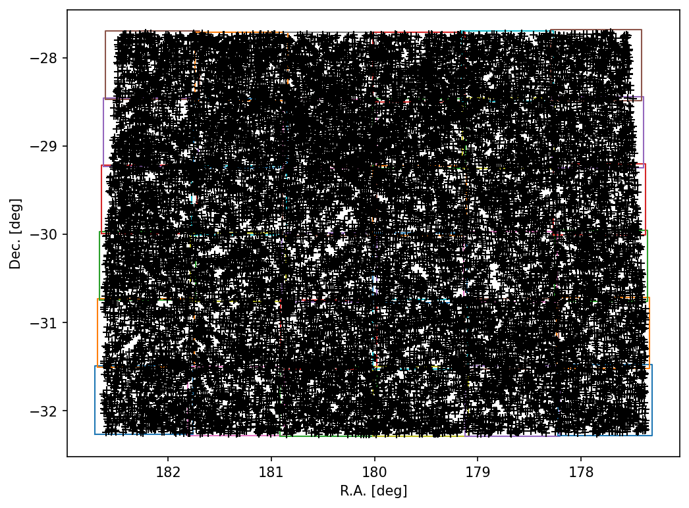

# Methodology

The workflow management system used is [snakemake](https://snakemake.readthedocs.io/en/stable/), which orchestrates the execution following rules to concantenate the input/ouput files required by each step. The data cube in fits format is pre-processed using library `spectral-cube` based on `dask` and `astropy`. First, the cube is divided in smaller subcubes. An overlap in pixels is included to avoid splitting sources close to the edges of the subcubes. We apply a source-finding algorithm to each subcube individual. 


After exploring different options, we selected  [Sofia-2](https://github.com/SoFiA-Admin/SoFiA-2) to mask the cubes and characterize the identified sources. The main outputs of Sofia-2 used are the source catalog, and the cubelets that include small cubes, spectra and  moment maps for each source are used for verification and inspection (this step is not included in the workflow and the exploration is performed manually). The Sofia-2 catalog is then converted to a new catalog containing the relevant source parameters requested by the SDC2, which are converted to the right physical units. 



The next step is to concatenate the individual catalogs in a main, unfiltered catalog containing all the measured sources. Then, we remove the duplicates coming from the overlapping regions between subcubes using a quality parameter from the Sofia-2 execution. We then filter the detected sources based on physical correlation. We use the correlation showed in Fig. 1 in Wang et al. 2016 ([2016MNRAS.460.2143W](https://ui.adsabs.harvard.edu/abs/2016MNRAS.460.2143W/abstract)), which relates the HI size in kpc ($D_HI$) and HI mass in solar masses ($M_HI$).


## Data exploration

We used different software to visualize the cube and related subproducts.

## Configuration

The key parameters for the execution of the pipeline can be selected by editing the file `config/config.yaml`. In the general case, only this parameters file controls how the cube is gridded and how Sofia-2 is executed. The control parameters for Sofia-2 are directly controlled using the sofia par file template in `config/sofia_12.par`. The default configuration files can be found here: [config](../config/).

## unit tests

To verify the outputs of the different steps of the workflow, we implemented a series of python unit tests based on the steps defined by the snakemake rules. The unit test contain simple examples of inputs and outputs of each rule, so when the particular rule in executed, their outputs are compared byte by byte to the expected output. The tests are passed only when all the output files match exactly the expected ones. These test are useful to be confident that any changes introduced in the code during developement are producing the same results, preventing the developers to introduce bug inadvertently.

We executed the tests on [myBinder](https://mybinder.org/), which automatically installs all the dependencies. We run this single command and obtained the following output:
```
jovyan@jupyter-hi-2dfriends-2dsdc2-2dhi-2dfriends-2dfsc1x4x2:~$ python -m pytest .tests/unit/
=================================================================== test session starts ===================================================================
platform linux -- Python 3.9.6, pytest-6.2.4, py-1.10.
rootdir: /home/jovyan
plugins: anyio-2.2.0
collected 6 items

.tests/unit/test_all.py .                                                                                                                           [ 16%]
.tests/unit/test_concatenate_catalogs.py .                                                                                                          [ 33%]
.tests/unit/test_define_chunks.py .                                                                                                                 [ 50%]
.tests/unit/test_final_catalog.py .                                                                                                                 [ 66%]
.tests/unit/test_run_sofia.py .                                                                                                                     [ 83%]
.tests/unit/test_sofia2cat.py .                                                                                                                     [100%]

============================================================== 6 passed in 206.24s (0:03:26) ==============================================================
```

## Software managed and containerization

As explained above, the workflow is managed using snakemake, which means that all the dependencies are automatically created and organized by snakemake using `conda`. Each rule has its own conda environment file, which is installed in a local conda environment when the workflow starts. The environments are being activated as required by the rules. This allows us to use the exact software versions for each step, without any conflict. All the software used is available for download from [Anaconda](https://anaconda.org/). The only conflict with this approach is that Sofia-2 has not yet created a conda package for version 2.3.0 compatible with Mac, so this approach will not work in MacOS. To facilitate correct usage from any platform, we have also containerized the workflow.

We have used different container formats to encapsulate the workflow. In particular, we have definition files for Docker, Singularity and podman container formats. The Github repository contains the required files, and instructions to build and use the containers can be found in the [installation instructions](installation.md).


## Check conformance to coding standards 

Pylint is a Python static code analysis tool which looks for programming errors, helps enforcing a coding standard and looks for code smells (see [Pylint documentation](http://pylint.pycqa.org/). 
It can be installed by running 
```
pip install pylint
```
If you are using Python 3.6+, upgrade to get full support for your version:
```
pip install pylint --upgrade
```
For more information on Pylint installation see [Pylint installation](https://pylint.pycqa.org/en/latest/user_guide/installation.html)

We runned Pylint in our source code. Most of the code extrictly complies with python coding standards. The final `pylint` score of the code is:

```
Your code has been rated at 10.00/10 (previous run: 10.00/10, +0.00)
Your code has been rated at 1.33/10 (previous run: 1.33/10, +0.00)
Your code has been rated at 5.74/10 (previous run: 5.74/10, +0.00)
Your code has been rated at 9.39/10 (previous run: 9.39/10, +0.00)
Your code has been rated at 9.24/10 (previous run: 9.24/10, +0.00)
Your code has been rated at 10.00/10 (previous run: 10.00/10, +0.00)
```


