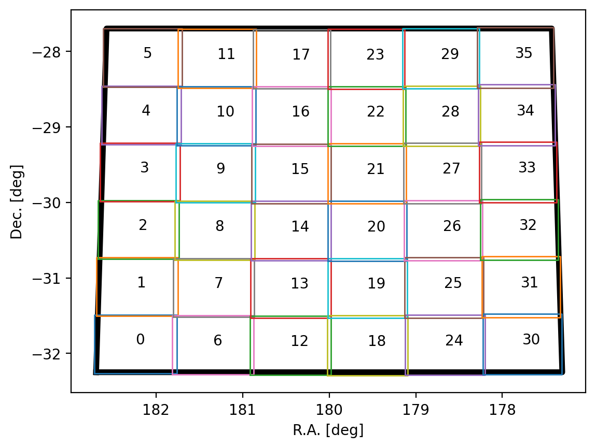

# SDC2 HI-FRIENDS results

## Score

The result obtained by the HI-FRIENDS team can be seen in the figure below which comes from the [leaderboard](https://sdc2.astronomers.skatelescope.org/sdc2-challenge/leaderboard) section in the SDC2 website. 


## Our solution

For our solution we used this configuration file:

```yaml
# General
threads: 31

# Cube selection
#incube: '/mnt/scratch/sdc2/data/evaluation/sky_eval.fits'
#incube: '/mnt/scratch/sdc2/data/development/sky_dev_v2.fits'
#incube: '/mnt/scratch/sdc2/data/development_large/sky_ldev_v2.fits'
incube: '/mnt/sdc2-datacube/sky_full_v2.fits'

# Splitting
subcube_id: 'all'
coord_file: results/plots/coord_subcubes.csv
grid_plot: results/plots/subcube_grid.png
num_subcubes: 36
pixel_overlap: 40

# Sofia
sofia_param: "config/sofia_12.par"
scfind_threshold: 4.5
reliability_fmin: 5.0
reliability_threshold: 0.5
```

The 36 subcubes were gridded following this pattern:


The distribution of sources in the sky were:


We detected 22346 sources (once duplicates in the overlapping regions are removed).

This is the distribution of parameters in our catalog (blue), and how does it compare with the truth catalog of the large development cube (in grey), which covers a smaller area and therefore contain fewer sources.


We then filtered the catalog to exclude sources that deviate significantly from the  Wang et al. 2016 ([2016MNRAS.460.2143W](https://ui.adsabs.harvard.edu/abs/2016MNRAS.460.2143W/abstract)) correlation between HI size in kpc ($D_HI$) and HI mass in solar masses ($M_HI$). This is the resulting catalog:


These results will be uploaded to Zenodo.

