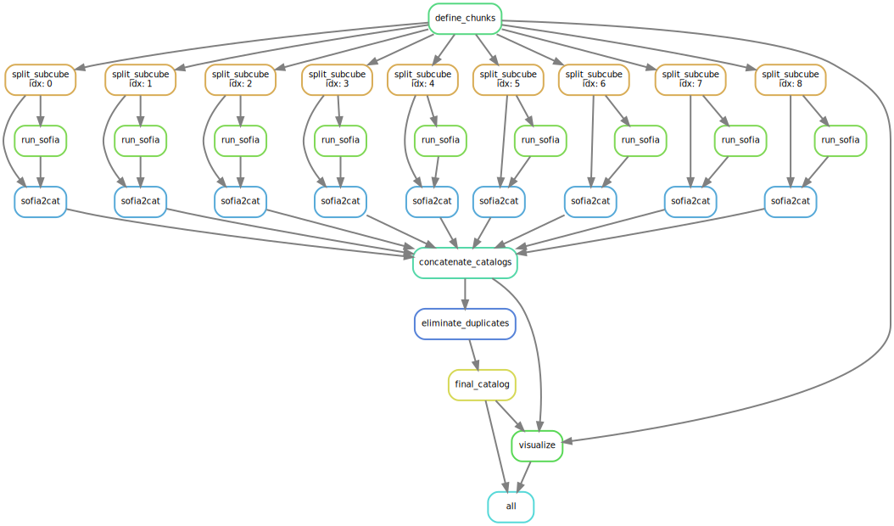
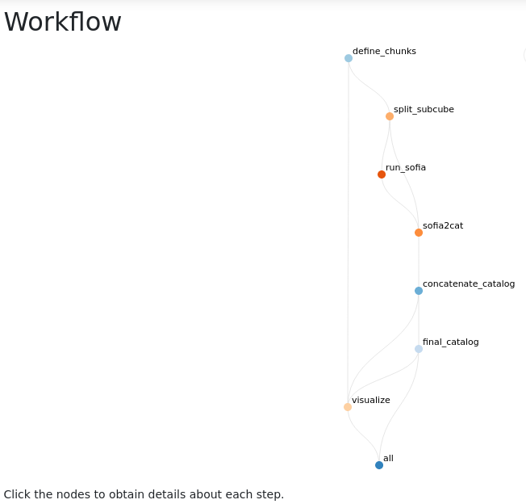
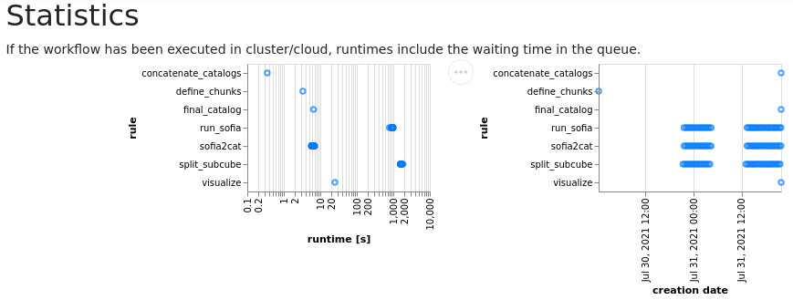

# Workflow


# Workflow structure and products

The following diagram shows the rules executed by the workflow and their dependencies. Each rule is associated with the execution of either a python script, a jupyter notebook or a bash script.


The actual execution of the workflow requires some of the rules to be executed multiple times. In particular each subcube is processed sequentially. The next diagram shows the [DAG](https://en.wikipedia.org/wiki/Directed_acyclic_graph) of an example execution. The number of parallel jobs is variable, here we show the case of 16 subcubes, although for the full SDC2 cube we may use 36 or 49 subcubes.



Each rule has associated input and output files. The following diagram shows the stage at which the relevant files are 


## Workflow file structure

The workflow consists of a master `Snakefile` file (analogous to a Makefile for `make`), a series of conda environments, scripts and notebooks to be executed, and rules to manage the workflow tasks. The file organization of the workflow is the following:
```
workflow/
├── Snakefile
├── envs
│   ├── analysis.yml
│   ├── chunk_data.yml
│   ├── process_data.yml
│   ├── snakemake.yml
│   └── xmatch_catalogs.yml
├── notebooks
│   └── sdc2_hi-friends.ipynb
├── rules
│   ├── chunk_data.smk
│   ├── concatenate_catalogs.smk
│   ├── run_sofia.smk
│   ├── summary.smk
│   └── visualize_products.smk
└── scripts
    ├── define_chunks.py
    ├── eliminate_duplicates.py
    ├── run_sofia.py
    ├── sofia2cat.py
    └── split_subcube.py
```


## Output products

All the outputs of the workflow are stored in `results`. This is the first level organization of the directories:

```
results/
├── catalogs
├── logs
├── notebooks
├── plots
└── sofia
```
In particular, each rule generates a log for the execution of the scripts. They are stored in `results/logs`. Each subdirectory contains individual logs for each executtion, as shown in this example:
```
logs/
├── concatenate
│   ├── concatenate_catalogs.log
│   └── eliminate_duplicates.log
├── define_chunks
│   └── define_chunks.log
├── run_sofia
│   ├── subcube_0.log
│   ├── subcube_1.log
│   ├── subcube_2.log
│   └── subcube_3.log
├── sofia2cat
│   ├── subcube_0.log
│   ├── subcube_1.log
│   ├── subcube_2.log
│   └── subcube_3.log
├── split_subcube
│   ├── subcube_0.log
│   ├── subcube_1.log
│   ├── subcube_2.log
│   └── subcube_3.log
├── summary
│   ├── dag.log
│   ├── filegraph.log
│   └── rulegraph.log
└── visualize
    └── visualize.log
```

The individual fits files of the subcubes are storesd in the directory `interim`, because they may be large to store. The workflow can be setup to make them temporary files, so they are removed as soon as they are not needed anymore
```
interim/
└── subcubes
    ├── subcube_0.fits
    ├── subcube_1.fits
    ├── subcube_2.fits
    └── subcube_3.fits
```


## Snakemake execution and diagrams

Additional files summarizing the execution of the workflow and the Snakemake rules are stored in 
```
summary/
├── dag.svg
├── filegraph.svg
├── report.html
└── rulegraph.svg
```
In particular, `report.hml` contains a description of the rules, including the provenance of each execution, as well as the statistics on execution times of each rule.

Interactive report showing the workflow structure:


When clicking in one of the nodes, full provenance is provided:


Statistics of the time required for each execution:
:w


